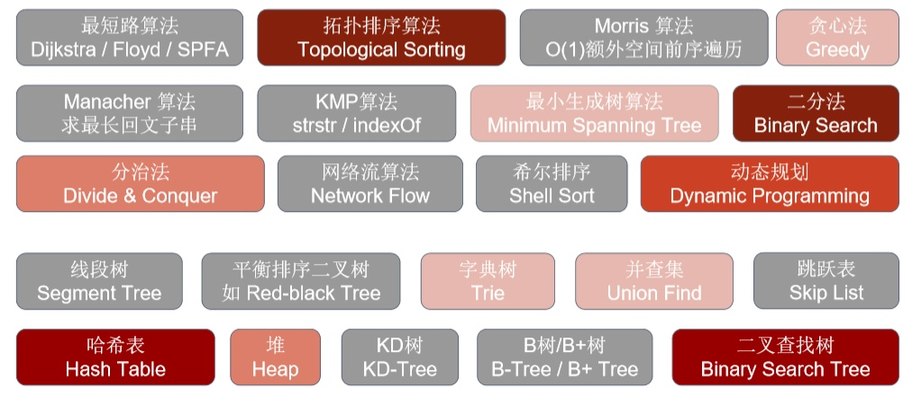

# LeetCode刷题指南

- [LeetCode刷题指南](#leetcode刷题指南)
  - [刷题步骤](#刷题步骤)
  - [算法记录](#算法记录)
    - [栈和队列](#栈和队列)
      - [栈](#栈)
      - [队列](#队列)

## 刷题步骤

1. HOT 100 -> 精选TOP面试题
2. 简单 -> 中等 -> 困难
3. 标签： 按下图面试题频率（颜色越红，表示面试中碰到的概率越高；灰色的基本不考，或者出现概率很低）

   1. 拓扑排序
   2. 二分法
   3. **哈希表**
   4. 二叉查找树
   5. 动态规划
   6. 分治法
   7. 堆
   8. 贪心法
   9. 最小生成树
   10. 字典树
   11. 并查集

## 算法记录

### 栈和队列

#### 栈

1. C++中stack 是容器么？
   栈是以底层容器完成其所有的工作，对外提供统一的接口，底层容器是可插拔的（也就是说我们可以控制使用哪种容器来实现栈的功能）。
   所以STL中栈往往不被归类为容器，而被归类为container adapter（容器适配器）。
2. 我们使用的stack是属于那个版本的STL？
   SGI STL由Silicon Graphics Computer Systems公司参照HP STL实现，被Linux的C++编译器GCC所采用，SGI STL是开源软件，源码可读性甚高。
3. 我们使用的STL中stack是如何实现的？
   我们常用的SGI STL，如果没有指定底层实现的话，默认是以deque为缺省情况下栈的低层结构。
   SGI STL中 队列底层实现缺省情况下一样使用deque实现的。
4. stack 提供迭代器来遍历stack空间么？
   所有元素必须符合先进后出规则，所以栈不提供走访功能，也不提供迭代器(iterator)。
   指定vector为栈的底层实现，初始化语句如下：
   `std::stack<int, std::vector<int> > third;  // 使用vector为底层容器的栈`

#### 队列

1. 队列 先进先出的数据结构，同样不允许有遍历行为，不提供迭代器, SGI STL中队列一样是以deque为缺省情况下的底部结构。
2. 指定list 为起底层实现
   `std::queue<int, std::list<int>> third; // 定义以list为底层容器的队列`
